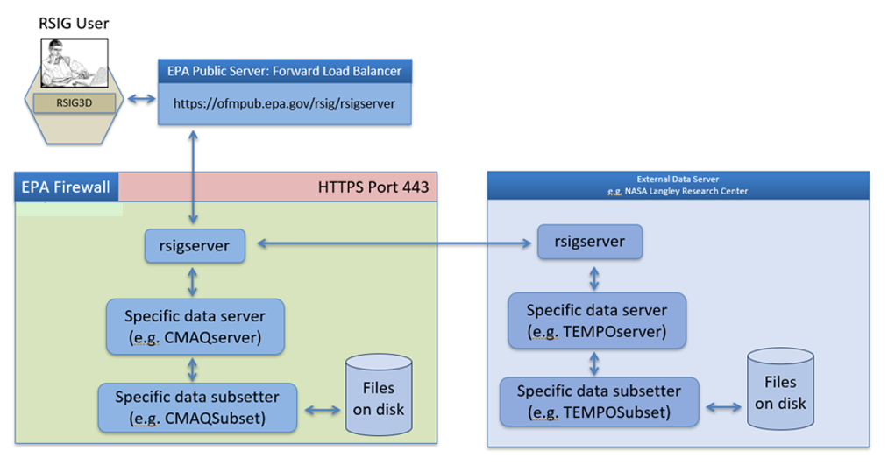
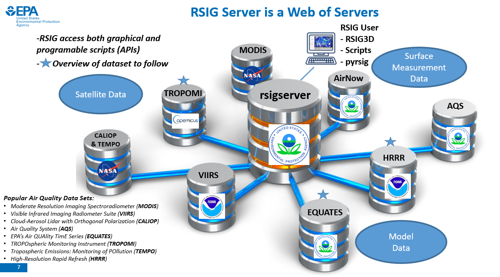

# RSIG Project Overview

RSIG (Remote Sensing Information Gateway) is a free multi-platform, scriptable
software system for quickly and easily retrieving, visualizing and saving
subsets of selected remote geospatial atmospheric data on the Web.

Its primary audience is environmental modelers interested in historic and
contemporary air-quality analysis, trends and events.

The RSIG3D application and rsigserver public web service provides quick
retrieval of subsets of over 4,000 variables (100s of TBs) of atmospheric
datasets from EPA, NASA, NOAA, ESA and other data creators - usually in
about a minute or two - where it can be visualized and saved in common
file formats (NetCDF, ASCII spreadsheet, KML, etc.) for further analysis.

Types of atmospheric data include meteorology and air pollution time-series
from air-quality models, satellites, aircraft and ground stations.

RSIG was developed by contractors for the US EPA in Research Triangle Park, NC.  

Publicly-accessible web site: https://epa.gov/rsig  

RSIG Unique/Key Features:
1. Single website virtually serving many kinds of data, including:  
   - EPA CMAQ model 12km 3D gridded air-quality and meteorology
      (Ozone, PM 2.5, Temp, Wind)  
   - NASA Goddard MODIS global satellite surface-integrated data
      (Ozone, Aerosol Optical Depth, Clouds, etc.)  
   - NASA Langley CALIPSO global satellite LIDAR data (Backscatter).  
   - EPA Airnow US Ground Stations (Ozone, PM2.5).  
   - EPA AQS US Ground Stations (Ozone, PM2.5).  
   - EPA UVNET US Ground Stations (Irradiance).  
   - NESDIS/GOES-Biomass Burning Surface Sites (PM2.5, CO, etc.) 
   - MOZAIC Aircraft-measured ozone, CO, RH, etc.  
   - NEUBrew ground LIDAR measured ozone.  
2. Subsetting by:  
   - Time: extract & transfer only data within an hourly range (over many days).  
   - Variable: extract & transfer only variables of interest.  
   - Domain: extract & transfer only data within a chosen longitude-latitude box.  
3. Aggregation:
   Combine data from thousands of files covering subset of interest
   into a single data stream.
4. Visualization:
   Interactive animation (at 30 frames / second!) of all data on a map
   displayed in a web browser. Can save animation file in MPEG or KMZ format.
5. Save subset to a local file:
   In various formats including: XDR binary, ASCII spreadsheet, NetCDF, etc.
6. Fast! 
   Months of manual effort to get data - now done in seconds!

### Data flow
This simplified data flow diagram shows the relationship between the main components of RSIG, including the rsigserver script, data specific scripts such as temposerver, data specific subsetters such as TEMPOSubset, and the actual data files on disk. **It is important that the specific server and subsetter programs have fast access to the data files to maintain efficient data throughput.** This usually means that the programs should reside on the same filesystem as the data.  

*Figure 1: Simplified RSIG data flow*

### rsigserver and other utility servers
  
The primary back-end entry point to the RSIG system is rsigserver, which can be found in the rsig directory along with other utility servers:  
- compareserver  
- outageserver  
- satellitepmserver  
- check\_server\_status  

 
 *Figure 2: RSIG overview*

## Specific data servers

Behind the scenes there are other components involved which are invoked depending on arguments given to rsigserver. For example, this URL can be used to acquire Airnow data via rsigserver:   

> https://ofmpub.epa.gov/rsig/rsigserver?SERVICE=wcs&VERSION=1.0.0&REQUEST=GetCoverage&FORMAT=xdr&TIME=2025-05-08T00:00:00Z/2025-05-08T23:59:59Z&BBOX=-78.750000,35.120000,-75.380000,37.940000&COVERAGE=airnow.no2&COMPRESS=1 

When the request is processed rsigserver will automatically invoke airnowserver behind the scenes. The specific data servers are not directly exposed to the user. 

All of the code needed to operate a specific data server is contained in their respective directories (e.g. the tempo directory contains all of the code needed to implement a standalone server to serve TEMPO data). Inside each directory you will find: 

1. An OGC-WCS compliant PERL-CGI server program. e.g. temposerver.  
 
2. A subsetter C program (e.g. TEMPOServer). The subsetters are what do the real work of opening and reading data files, extracting only the desired content (time range, bounding box, and variable), aggregating data that may span across several data files, and streaming it back to the source.  

3. A conversion program called XDRConvert that converts the format streamed by subsetters (xdr) to other formats such as ASCII, NetCDF-COARDS, regridded NetCDF-IOAPI, etc.  

4. Utility programs. Many of the utility programs are used by multiple (or all) \*servers, but for ease of installation they are included in the main directory for each source.  

### C source code  
C source code for internally-developed reusable C routines are included in the src directory for each data source.  

The Subsetter and XDRConvert are installed at the source of the data,
for example, MODISSubset, XDRConvert and modisserver are installed at
NASA Goddard: http://lpweb.nascom.nasa.gov/cgi-bin/modisserver.
This enables the very large and numerous HDF data files to be subset at the
source so only the specified subset of data is streamed across the network
resulting in extremely fast and efficient data access: under 30 seconds per
24-hours of data over the continental US.

The design intent is to develop and install the data-specific Subsetters and
servers at each of the remote sites.

